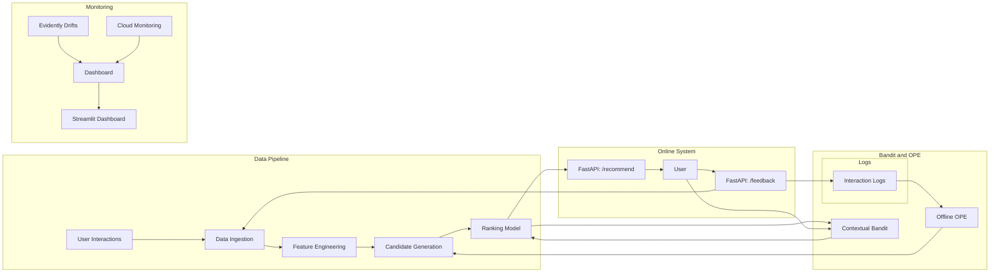

```mermaid
flowchart LR
  subgraph Data Pipeline
    A[User Interactions] --> B[Data Ingestion]
    B --> C[Feature Engineering]
    C --> D[Candidate Generation]
    D --> E[Ranking Model]
  end
  subgraph Online System
    E --> F[FastAPI: /recommend]
    F --> G[User]
    G --> H[FastAPI: /feedback ]
    H --> B
  end
  subgraph Bandit and OPE
    E --> I[Contextual Bandit]
    G --> I
    I --> E
    subgraph Logs
      H --> J[Interaction Logs]
    end
    J --> K[Offline OPE]
    K --> D
  end
  subgraph Monitoring
    L[Evidently Drifts] --> M[Dashboard]
    N[Cloud Monitoring] --> M
    M --> O[Streamlit Dashboard]
  end
```